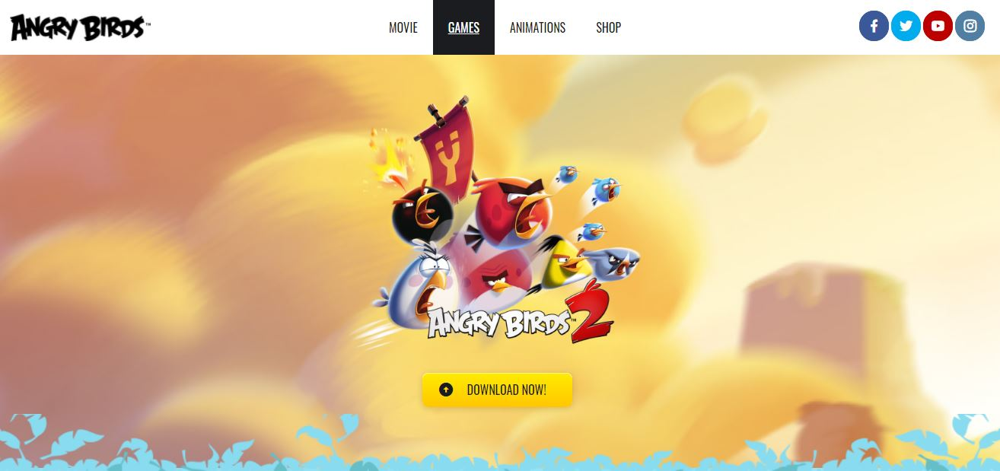

# Codeable - Angry Birds Template

This is my second project of Codeable. Codeable is a peruvian bootcamp of full stack web development.

## Table of contents

- [Overview](#overview)
  - [The challenge](#the-challenge)
  - [Screenshot](#screenshot)
  - [Links](#links)
- [My process](#my-process)
  - [Built with](#built-with)
  - [What I learned](#what-i-learned)
  - [Continued development](#continued-development)
  - [Useful resources](#useful-resources)
- [Author](#author)
- [Acknowledgments](#acknowledgments)

## Overview

### The challenge

- Make a special template about Angry Birds website.

- Keep your code DRY (don't repeat yourself).

- Organize your files and directories properly.

- Use semantic HTML and some methodology to name your CSS classes (BEM for example).

- Run your page through Lighthouse to spot any major a11y issues and try to get a green score.

- Use Responsive Design in this project.

### Screenshot



### Links

- [Solution Link](https://github.com/heraldofortuna/angry-birds-template)
- [Live Site Link](https://heraldofortuna.github.io/angry-birds-template/)

## My process

### Built with

- Semantic HTML5 markup
- CSS custom properties
- Flexbox
- CSS Grid
- Responsive Design

### What I learned

I learned how to create an special button effect.

```html
<button class="button">
  <span class="button__left"><i class="ri-arrow-up-circle-fill"></i></span>
  <span class="button__text">Download now!</span>
  <span class="button__right"><i class="ri-arrow-down-circle-fill"></i></span>
</button>
```

```css
.button__text {
  color: var(--black-color);
  font-size: 17px;
  line-height: 28px;
  transform: translate(15px, 0);
  transition: var(--transition);
}

.button__left {
  opacity: 1;
  transform: translate(-5px, 0);
  transition: var(--transition);
}

.button__right {
  opacity: 0;
  transform: translate(50px, -50px);
  transition: var(--transition);
}
```

### Continued development

Now I will continue with another Codeable project.

### Useful resources

I used the guides found on Codeable website. Only that.

## Author

- Codeable - [Codeable](https://www.codeable.la/)
- Twitter - [@heraldofortuna](https://twitter.com/heraldofortuna)

## Acknowledgments

To Diego, Wences and Deyvi, my mentors.
